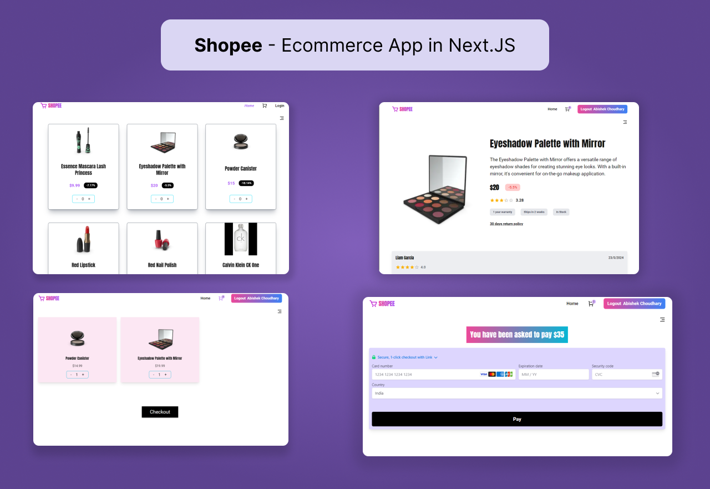

# Trello Clone 2.0 in Next.js

## Tech Stack

- Zustand :- for state management
- Typescript :- for safe type checking
- TailwindCSS :- for CSS
- React Icons :- for icons
- Firebase :- for Authentication
- Framer Motion :- for animation
- Anchor Pki :- to convert http server to https
- Product API :- to fetch products
- Material UI :- for rating UI Component
- Stripe :- for payment gateway

## How to run Locally

1. First fork or clone the repo then inside root folder run `npm install` to install the dependencies.
2. Then make a .env.local file in root dir & initialize variables. Grab your secret & publishable key from Stripe Dashboard & make two variables.
   1. NEXT_PUBLIC_STRIPE_PUBLIC_KEY
   2. STRIPE_SECRET_KEY
3. You are done & ready to run inside the root folder run the command `npm run dev`.
4. One more thing u need to install _[Anchor Lcl](https://lcl.host/)_ as stripe payment gateway will throw error for using http instead of https.

**You can view the live site _[Shopee Live](https://next-js-e-commerce-store-redux.vercel.app/)_**

### Shopee UI

